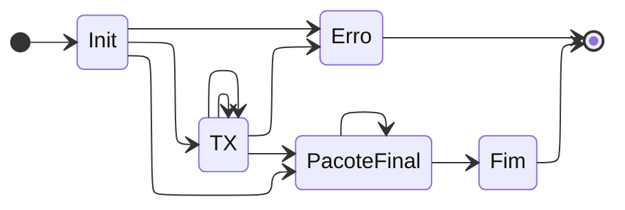
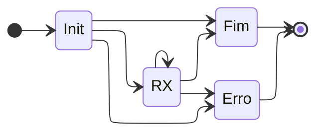

# Projeto1: TFTP

```
@arthurcadore ➜ /workspaces/projeto-1-um-protocolo-de-transfer-ncia-de-arquivos-amr-tftp (main) $ cmake CMakeLists.txt 
-- The C compiler identification is GNU 9.4.0
-- The CXX compiler identification is GNU 9.4.0
-- Check for working C compiler: /usr/bin/cc
-- Check for working C compiler: /usr/bin/cc -- works
-- Detecting C compiler ABI info
-- Detecting C compiler ABI info - done
-- Detecting C compile features
-- Detecting C compile features - done
-- Check for working CXX compiler: /usr/bin/c++
-- Check for working CXX compiler: /usr/bin/c++ -- works
-- Detecting CXX compiler ABI info
-- Detecting CXX compiler ABI info - done
-- Detecting CXX compile features
-- Detecting CXX compile features - done
-- Configuring done
-- Generating done
-- Build files have been written to: /workspaces/projeto-1-um-protocolo-de-transfer-ncia-de-arquivos-amr-tftp
@arthurcadore ➜ /workspaces/projeto-1-um-protocolo-de-transfer-ncia-de-arquivos-amr-tftp (main) $ make run
Scanning dependencies of target tftpclient
[ 50%] Building CXX object CMakeFiles/tftpclient.dir/app/main.cpp.o
[100%] Linking CXX executable tftpclient
[100%] Built target tftpclient
```

Na unidade 1 de Projeto de Protocolos sua equipe irá implementar o protocolo de aplicação TFTP, seguindo sua especificação contida na RFC 1350. Durante este projeto, os conceitos estudados serã aplicados para que, ao final, se obtenha um protocolo funcional e consistente com a especificação.

Há dois objetivos específicos para esse trabalho:
* **Desenvolver uma biblioteca TFTP**: o cliente do protocolo TFTP deve ser feito na forma de uma biblioteca, de forma que possa ser reutilizado em aplicações que precisem desse protocolo.
* **Escrever um aplicativo demonstrativo**: usando sua biblioteca, deve-se criar um aplicativo capaz de enviar e receber arquivos usando o protocolo TFTP

Sua implementação do protocolo TFTP deve ser capaz de se comunicar com um servidor TFTP de referência. Para essa finalidade, será usado um servidor TFTP disponível para o sistema operacional Linux.
* [tftp_server](https://moodle.ifsc.edu.br/mod/resource/view.php?id=185347): um servidor tftp rudimentar feito para este projeto

As instruções para as estapas deste projeto serão fornecidas no [material de PTC contido no Moodle](https://moodle.ifsc.edu.br/course/view.php?id=4072#section-2).


### Máquina de estado envio ###



### Máquina de estado recepção ###

