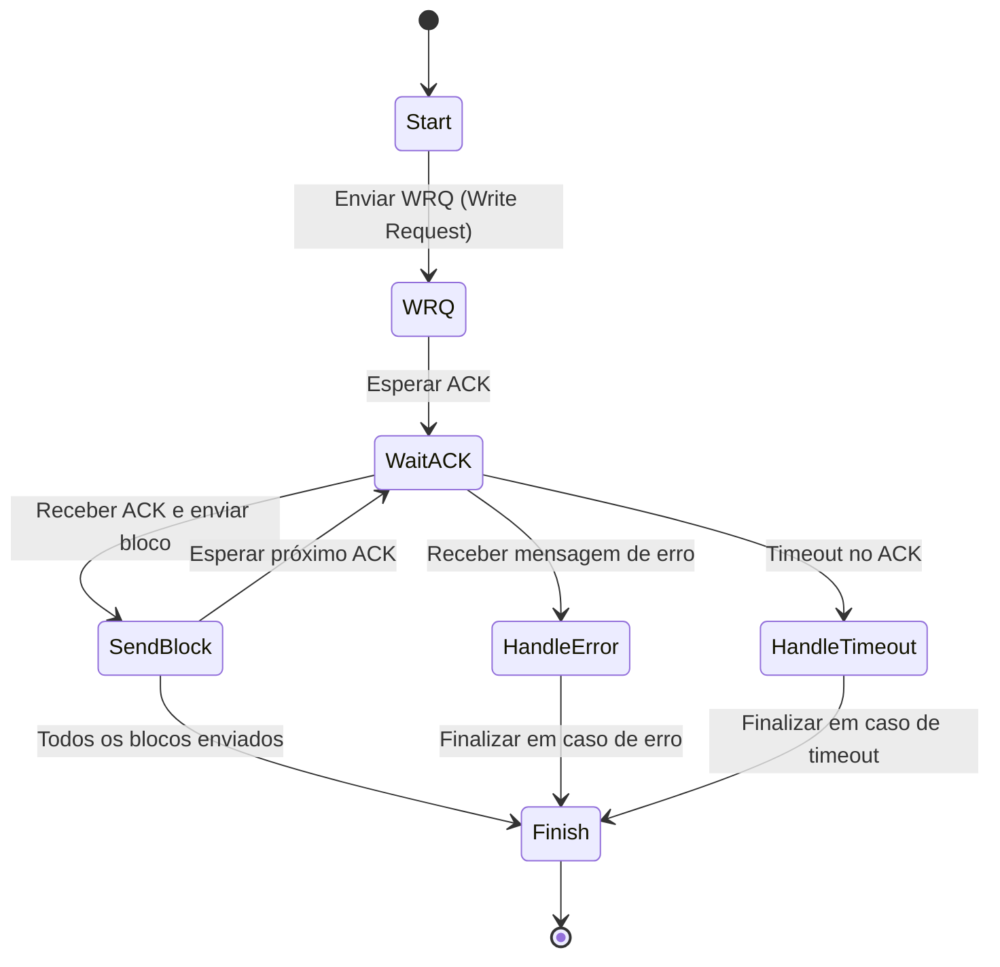
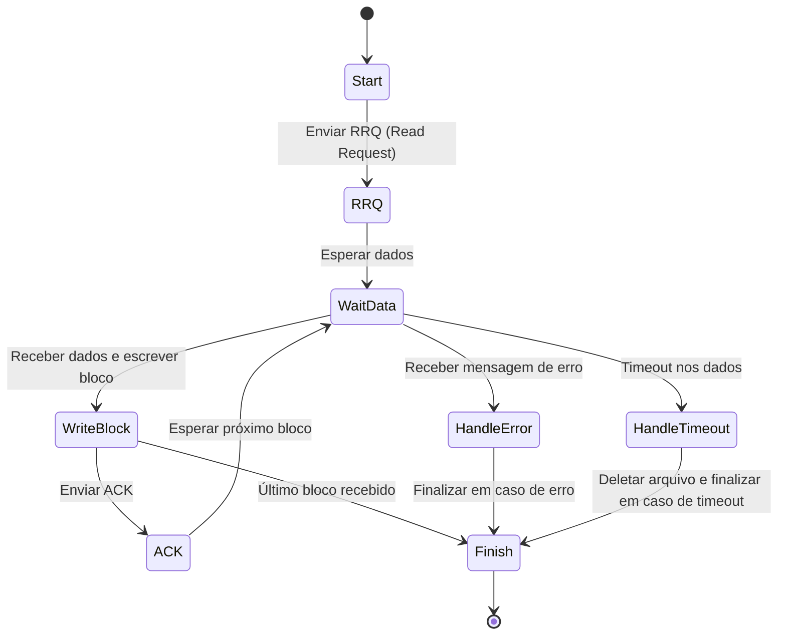

# Open TFTP

Open TFTP é uma implementação simplificada e modular do protocolo Trivial File Transfer Protocol (TFTP), conforme definido na [RFC 1350](https://datatracker.ietf.org/doc/html/rfc1350). Este projeto explora o funcionamento básico do protocolo, desde a comunicação de rede até as máquinas de estado para upload e download de arquivos.

---

## **Visão Geral**

TFTP é um protocolo de transferência de arquivos que opera sobre UDP, projetado para ser simples e eficiente. Este projeto implementa as seguintes funcionalidades principais:

1. **Upload de arquivos (WRQ)**: Permite o envio de arquivos do cliente para o servidor.
2. **Download de arquivos (RRQ)**: Permite a transferência de arquivos do servidor para o cliente.
3. **Tratamento de mensagens de controle e erro**: Implementa as operações básicas de acordo com os opcodes definidos pela RFC 1350.
4. **Estrutura modular**: Usa classes para segmentar o código em responsabilidades específicas (mensagens, cliente TFTP, callbacks e polling).
5. **Máquinas de estado**: Gerencia o fluxo de execução para upload e download de arquivos, garantindo confiabilidade mesmo em caso de erros ou timeouts.

---

## **Estrutura do Projeto**

### **Diretórios Principais**
- `src/`: Contém os arquivos-fonte principais.
- `libs/`: Inclui bibliotecas auxiliares, como o poller para controle assíncrono.

---

## **Estrutura de Classes**

A arquitetura do projeto foi desenhada para ser modular e extensível, com foco na separação de responsabilidades. O diagrama abaixo descreve as classes principais:

```mermaid
classDiagram
    class tftpclient {
        +string ip
        +string port
        +string filename
        +sockaddr_in serverAddr
        +int sockfd
        +long timeout
        +tftpclient(string ip, string port, string filename, long timeout)
        +void upload()
        +void download()
    }

    class uploadCallback {
        +sockaddr_in serverAddr
        +string filename
        +int blockNumber
        +int totalBlocks
        +int blocksize
        +int fileSize
        +bool lastblock
        +int sockfd
        +bool error
        +int lastBlocksize
        +uploadCallback(sockaddr_in serverAddr, int sockfd, string filename, long timeout)
        +void handle()
        +void handle_timeout()
    }

    class downloadCallback {
        +sockaddr_in serverAddr
        +string filename
        +int blockNumber
        +int totalBlocks
        +int blocksize
        +int fileSize
        +bool lastblock
        +int sockfd
        +bool error
        +downloadCallback(sockaddr_in serverAddr, int sockfd, string filename, long timeout)
        +void handle()
        +void handle_timeout()
    }

    class Poller {
        +void adiciona(Callback* cb)
        +void despache()
    }

    class Callback {
        +int fd
        +long timeout
        +Callback(int fd, long timeout)
        +virtual void handle()
        +virtual void handle_timeout()
    }

    class Main {
        +int main(int argc, char** argv)
    }

    class inet {
        +inet()
        +void run()
        +void stop()
        -tftpclient tftp
        -uploadCallback upload
        -downloadCallback download
    }

    class requestMessage {
        +OpcodeRM opcode
        +string filename
        +string mode
        +requestMessage(OpcodeRM opcode, string filename)
        +std::vector<uint8_t> serialize()
    }

    class dataMessage {
        +OpcodeDM opcode
        +uint16_t blockNumber
        +std::string data
        +dataMessage(OpcodeDM opcode, uint16_t blockNumber, string data)
        +std::vector<uint8_t> serialize()
        +static dataMessage deserialize(char buffer[], int comprimento)
        +std::string printData()
        +int printBN()
    }

    class ackMessage {
        +OpcodeAM opcode
        +uint16_t blockNumber
        +ackMessage(OpcodeAM opcode, uint16_t blockNumber)
        +std::vector<uint8_t> serialize()
        +static ackMessage deserialize(char buffer[], int comprimento)
        +std::string printBN()
    }

    class errorMessage {
        +OpcodeEM opcode
        +uint16_t errorCode
        +string errMsg
        +errorMessage(OpcodeEM opcode, uint16_t errorCode, string errMsg)
        +std::vector<uint8_t> serialize()
        +static errorMessage deserialize(char buffer[], int comprimento)
        +std::string printData()
    }

    class IO {
        +static bool fileCheck(string nomeArquivo)
        +static int fileLength(string nomeArquivo)
        +static char* readBlock(string nomeArquivo, int n, int blockSize, int length)
        +static void writeBlock(string nomeArquivo, string block)
        +static void deleteFile(string nomeArquivo)
    }

    tftpclient --> uploadCallback : creates
    tftpclient --> downloadCallback : creates
    uploadCallback --> Poller : added to
    downloadCallback --> Poller : added to
    Callback <|-- uploadCallback
    Callback <|-- downloadCallback
    Main --> tftpclient : uses
    Poller --> Main : interacts with
    inet --> tftpclient : has
    inet --> uploadCallback : has
    inet --> downloadCallback : has
    inet --> Poller : uses
    inet --> IO : uses
    inet --> requestMessage : uses
    inet --> dataMessage : uses
    inet --> ackMessage : uses
    inet --> errorMessage : uses


```



## **Estrutura de Mensagens**
O projeto implementa mensagens seguindo o formato descrito na RFC 1350.

### **Tipos de Mensagens e Estruturas**
- RRQ / WRQ:
```
 2 bytes     string    1 byte     string   1 byte
 ------------------------------------------------
| Opcode |  Filename  |   0  |   "octet"   |   0  |
 ------------------------------------------------
```
- Data:
```
 2 bytes     2 bytes      512 bytes
-----------------------------------
| Opcode |   Block #  |   Data     |
-----------------------------------
```
- ACK:
```
 2 bytes     2 bytes
---------------------
| Opcode |   Block #  |
---------------------
```
- ERROR:
```
 2 bytes     2 bytes      string    1 byte
-----------------------------------------
| Opcode |  ErrorCode |   ErrMsg   |   0  |
-----------------------------------------
```

### Operational Codes
- ```1```: RRQ (Read Request)
- ```2```: WRQ (Write Request)
- ```3```: DATA (Data Block)
- ```4```: ACK (Acknowledgment)
- ```5```: ERROR (Error Message)

## **Máquinas de Estado**
### **Envio de Arquivos (WRQ)**

### **Recebimento de Arquivos (RRQ)**


## **Como Executar**
### Dependências
- Compilador C++ (GCC ou Clang)
- Biblioteca ```poll.h``` incluída no diretório ```libs```

### Execução
- Compile o projeto:
```bash
make
```
- Execute o cliente:
```bash
./tftpclient <IP> <PORT> <FILENAME> <TIMEOUT>
```

