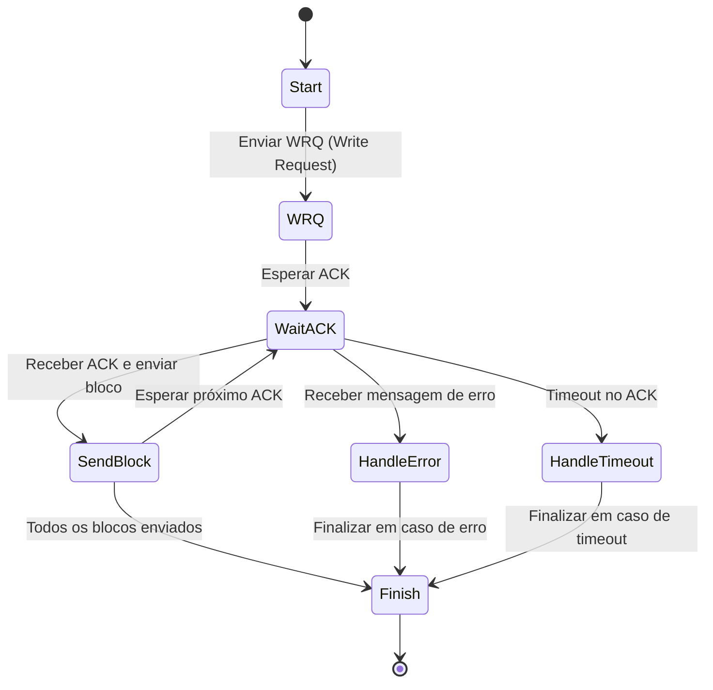
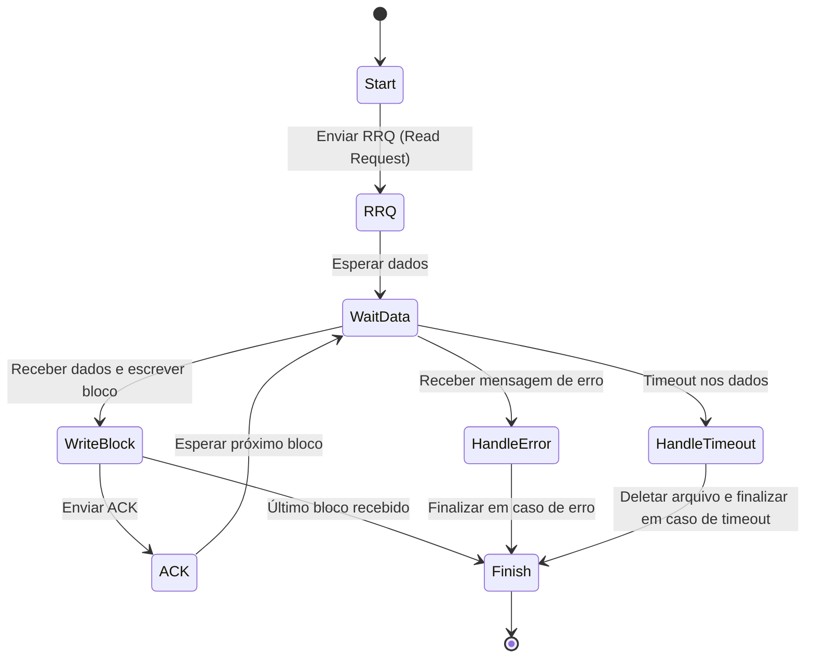

# Open TFTP

Open TFTP é uma implementação simplificada e modular do protocolo Trivial File Transfer Protocol (TFTP), conforme definido na [RFC 1350](https://datatracker.ietf.org/doc/html/rfc1350). Este projeto explora o funcionamento básico do protocolo, desde a comunicação de rede até as máquinas de estado para upload e download de arquivos, e foi ampliado para incluir funcionalidades de gerenciamento remoto, como renomeação, remoção, criação e listagem de arquivos e diretórios.

---

## **Visão Geral**

TFTP é um protocolo de transferência de arquivos que opera sobre UDP, projetado para ser simples e eficiente. Este projeto implementa as seguintes funcionalidades principais:

1. **Upload de arquivos (WRQ):** Permite o envio de arquivos do cliente para o servidor.
2. **Download de arquivos (RRQ):** Permite a transferência de arquivos do servidor para o cliente.
3. **Tratamento de mensagens de controle e erro:** Implementa as operações básicas de acordo com os opcodes definidos pela RFC 1350.
4. **Estrutura modular:** Usa classes para segmentar o código em responsabilidades específicas (mensagens, cliente TFTP, callbacks e polling).
5. **Máquinas de estado:** Gerencia o fluxo de execução para upload e download de arquivos, garantindo confiabilidade mesmo em caso de erros ou timeouts.
6. **Gerenciamento remoto:** Novas operações permitem renomear (MOVE), remover (REMOVE), criar diretórios (MKDIR) e listar conteúdos (LIST) no servidor.

---

## **Estrutura do Projeto**

### **Diretórios Principais**
- `src/`: Contém os arquivos-fonte principais, incluindo a implementação do cliente TFTP, callbacks e a interface de linha de comando.
- `libs/`: Inclui bibliotecas auxiliares, como o poller para controle assíncrono.
- `proto/`: Arquivos de definição de mensagens para o Google Protocol Buffers.

---

## **Estrutura de Classes**

A arquitetura do projeto foi desenhada para ser modular e extensível, com foco na separação de responsabilidades. O diagrama abaixo descreve as classes principais:


```mermaid
classDiagram
    class tftpclient {
        +string ip
        +string port
        +string filename
        +sockaddr_in serverAddr
        +int sockfd
        +long timeout
        +tftpclient(string ip, string port, string filename, long timeout)
        +void upload()
        +void download()
        +void move(string newname)
        +void remove()
        +void mkdir()
        +void list()
    }

    class uploadCallback {
        +sockaddr_in serverAddr
        +string filename
        +int blockNumber
        +int totalBlocks
        +int blocksize
        +int fileSize
        +bool lastblock
        +int sockfd
        +bool error
        +int lastBlocksize
        +uploadCallback(sockaddr_in serverAddr, int sockfd, string filename, long timeout)
        +void handle()
        +void handle_timeout()
    }

    class downloadCallback {
        +sockaddr_in serverAddr
        +string filename
        +int blockNumber
        +int totalBlocks
        +int blocksize
        +int fileSize
        +bool lastblock
        +int sockfd
        +bool error
        +downloadCallback(sockaddr_in serverAddr, int sockfd, string filename, long timeout)
        +void handle()
        +void handle_timeout()
    }

    class moveCallback {
        +void handle()
        +void handle_timeout()
    }

    class removeCallback {
        +void handle()
        +void handle_timeout()
    }

    class mkdirCallback {
        +void handle()
        +void handle_timeout()
    }

    class listCallback {
        +void handle()
        +void handle_timeout()
    }

    class Poller {
        +void adiciona(Callback* cb)
        +void despache()
    }

    class Callback {
        +int fd
        +long timeout
        +Callback(int fd, long timeout)
        +virtual void handle()
        +virtual void handle_timeout()
    }

    class Main {
        +int main(int argc, char** argv)
    }

    class inet {
        +inet()
        +void run()
        +void stop()
        -tftpclient tftp
        -uploadCallback upload
        -downloadCallback download
    }

    class requestMessage {
        +OpcodeRM opcode
        +string filename
        +string mode
        +requestMessage(OpcodeRM opcode, string filename)
        +std::vector<uint8_t> serialize()
    }

    class dataMessage {
        +OpcodeDM opcode
        +uint16_t blockNumber
        +std::string data
        +dataMessage(OpcodeDM opcode, uint16_t blockNumber, string data)
        +std::vector<uint8_t> serialize()
        +static dataMessage deserialize(char buffer[], int comprimento)
        +std::string printData()
        +int printBN()
    }

    class ackMessage {
        +OpcodeAM opcode
        +uint16_t blockNumber
        +ackMessage(OpcodeAM opcode, uint16_t blockNumber)
        +std::vector<uint8_t> serialize()
        +static ackMessage deserialize(char buffer[], int comprimento)
        +std::string printBN()
    }

    class errorMessage {
        +OpcodeEM opcode
        +uint16_t errorCode
        +string errMsg
        +errorMessage(OpcodeEM opcode, uint16_t errorCode, string errMsg)
        +std::vector<uint8_t> serialize()
        +static errorMessage deserialize(char buffer[], int comprimento)
        +std::string printData()
    }

    class IO {
        +static bool fileCheck(string nomeArquivo)
        +static int fileLength(string nomeArquivo)
        +static char* readBlock(string nomeArquivo, int n, int blockSize, int length)
        +static void writeBlock(string nomeArquivo, string block)
        +static void deleteFile(string nomeArquivo)
    }

    tftpclient --> uploadCallback : creates
    tftpclient --> downloadCallback : creates
    uploadCallback --> Poller : added to
    downloadCallback --> Poller : added to
    Callback <|-- uploadCallback
    Callback <|-- downloadCallback
    Main --> tftpclient : uses
    Poller --> Main : interacts with
    inet --> tftpclient : has
    inet --> uploadCallback : has
    inet --> downloadCallback : has
    inet --> Poller : uses
    inet --> IO : uses
    inet --> requestMessage : uses
    inet --> dataMessage : uses
    inet --> ackMessage : uses
    inet --> errorMessage : uses
```

---

## **Estrutura de Mensagens**

O projeto utiliza o Google Protocol Buffers para a definição, serialização e desserialização das mensagens TFTP. A seguir, uma explicação detalhada de cada mensagem definida:

### **1. REQ (Request)**
Utilizada para as requisições de leitura (RRQ) e escrita (WRQ).

- **Campos:**
  - `fname` (required string): O nome do arquivo.
  - `mode` (required Mode): O modo de transferência. O enum **Mode** pode ter os valores:
    - `netascii = 1`
    - `octet = 2`
    - `mail = 3`

### **2. DATA**
Representa um bloco de dados a ser transferido.

- **Campos:**
  - `message` (required bytes): O conteúdo dos dados.
  - `block_n` (required uint32): O número do bloco.

### **3. ACK**
Utilizada para confirmar a recepção de um bloco de dados.

- **Campos:**
  - `block_n` (required uint32): O número do bloco que está sendo reconhecido.

### **4. Error**
Indica um erro ocorrido durante a transferência.

- **Campos:**
  - `errorcode` (required ErrorCode): O código do erro. O enum **ErrorCode** pode ter os valores:
    - `FileNotFound = 1`
    - `AccessViolation = 2`
    - `DiskFull = 3`
    - `IllegalOperation = 4`
    - `UnknownTid = 5`
    - `FileExists = 6`
    - `UnknownSession = 7`
    - `Undefined = 8`

### **5. Path**
Utilizada para operações que envolvem caminhos (por exemplo, listagem e criação de diretórios).

- **Campos:**
  - `path` (required string): O caminho do arquivo ou diretório.

### **6. ListResponse**
Contém uma lista de itens (arquivos e diretórios) em resposta a uma requisição de listagem.

- **Campos:**
  - `items` (repeated ListItem): Um conjunto de itens listados.

### **7. ListItem**
Representa um item listado, que pode ser um arquivo ou um diretório.

- **Campos:**
  - `answer` (oneof): Pode conter:
    - `file` (FILE): Estrutura representando um arquivo.
    - `dir` (Path): Estrutura representando um diretório.

### **8. FILE**
Define as propriedades de um arquivo listado.

- **Campos:**
  - `nome` (required string): O nome do arquivo.
  - `tamanho` (required int32): O tamanho do arquivo em bytes.

### **9. MOVE**
Utilizada para operações de renomeação ou movimentação.

- **Campos:**
  - `nome_orig` (required string): O nome original do arquivo.
  - `nome_novo` (optional string): O novo nome do arquivo (se aplicável).

### **10. Mensagem**
É a mensagem geral que engloba todos os tipos. Utiliza um campo `oneof` para definir o tipo específico da mensagem.

- **Campos (oneof msg):**
  - `rrq` (REQ): Requisição de leitura.
  - `wrq` (REQ): Requisição de escrita.
  - `data` (DATA): Bloco de dados.
  - `ack` (ACK): Confirmação de recebimento.
  - `error` (Error): Mensagem de erro.
  - `list` (Path): Requisição de listagem (caminho).
  - `list_resp` (ListResponse): Resposta de listagem.
  - `mkdir` (Path): Requisição para criar diretório.
  - `move` (MOVE): Requisição para renomear/mover arquivo.

### **Formato dos Pacotes TFTP**

Além da definição via Protocol Buffers, os pacotes TFTP seguem os formatos tradicionais:

- **RRQ / WRQ:**
  ```
   2 bytes     string    1 byte     string   1 byte
   ------------------------------------------------
  | Opcode |  Filename  |   0  |   "octet"   |   0  |
   ------------------------------------------------
  ```
- **Data:**
  ```
   2 bytes     2 bytes      512 bytes
  -----------------------------------
  | Opcode |   Block #  |   Data     |
  -----------------------------------
  ```
- **ACK:**
  ```
   2 bytes     2 bytes
  ---------------------
  | Opcode |   Block #  |
  ---------------------
  ```
- **ERROR:**
  ```
   2 bytes     2 bytes      string    1 byte
  -----------------------------------------
  | Opcode |  ErrorCode |   ErrMsg   |   0  |
  -----------------------------------------
  ```

### **Operational Codes**
- **1**: RRQ (Read Request)
- **2**: WRQ (Write Request)
- **3**: DATA (Data Block)
- **4**: ACK (Acknowledgment)
- **5**: ERROR (Error Message)

---

## **Máquinas de Estado**

### **Envio de Arquivos (WRQ)**

```mermaid
stateDiagram-v2
    [*] --> Start
    Start --> WRQ: Enviar WRQ (Write Request)
    WRQ --> WaitACK: Esperar ACK
    WaitACK --> SendBlock: Receber ACK e enviar bloco
    SendBlock --> WaitACK: Esperar próximo ACK
    SendBlock --> Finish: Todos os blocos enviados
    WaitACK --> HandleError: Receber mensagem de erro
    HandleError --> Finish: Finalizar em caso de erro
    WaitACK --> HandleTimeout: Timeout no ACK
    HandleTimeout --> Finish: Finalizar em caso de timeout
    Finish --> [*]
```

### **Recebimento de Arquivos (RRQ)**

```mermaid
stateDiagram-v2
    [*] --> Start
    Start --> RRQ: Enviar RRQ (Read Request)
    RRQ --> WaitData: Esperar dados
    WaitData --> WriteBlock: Receber dados e escrever bloco
    WriteBlock --> ACK: Enviar ACK
    ACK --> WaitData: Esperar próximo bloco
    WriteBlock --> Finish: Último bloco recebido
    WaitData --> HandleError: Receber mensagem de erro
    HandleError --> Finish: Finalizar em caso de erro
    WaitData --> HandleTimeout: Timeout nos dados
    HandleTimeout --> Finish: Deletar arquivo e finalizar em caso de timeout
    Finish --> [*]
```

---

## **Como Executar**

### Dependências
- **Compilador C++:** (GCC ou Clang)
- **Google Protocol Buffers:** Para serialização/desserialização das mensagens.
- **Biblioteca `poll.h`:** Disponível no diretório `libs/`.

### Compilação

Utilize o Makefile incluso para compilar o projeto:

```bash
make
```

### Execução

Para executar o cliente TFTP, utilize o comando:

```bash
./tftpclient <IP> <PORT> <FILENAME> <TIMEOUT>
```

**Exemplo:**

```bash
./tftpclient 192.168.0.100 69 exemplo.txt 5000
```

---

## **Interface de Linha de Comando (CLI)**

O projeto implementa uma interface interativa que permite ao usuário emitir comandos. Ao iniciar o programa com:

```bash
./tftpclient <IP> <PORTA>
```

Será exibido o prompt:

```
tftp >
```

Os comandos disponíveis são:

- **get \<arquivo\>**  
  Baixa o arquivo especificado do servidor.

- **put \<arquivo\>**  
  Envia o arquivo especificado para o servidor.

- **dir \<diretório\>**  
  Lista o conteúdo do diretório especificado no servidor.

- **move \<origem\> \<destino\>**  
  Renomeia ou move um arquivo do nome de origem para o novo nome.

- **mkdir \<diretório\>**  
  Cria um novo diretório no servidor.

- **remove \<arquivo/diretório\>**  
  Remove o arquivo ou diretório especificado do servidor.

- **exit**  
  Encerra o programa.

**Exemplo de Uso:**

```bash
./tftpclient 192.168.0.100 69
```

No prompt interativo:

```
tftp > get exemplo.txt
tftp > put exemplo.txt
tftp > dir diretorio_exemplo
tftp > move exemplo.txt novo_nome.txt
tftp > mkdir novo_diretorio
tftp > remove exemplo.txt
tftp > exit
```

Internamente, o programa converte o comando digitado para um enum e executa a operação correspondente, criando um objeto `tftpclient` com os parâmetros fornecidos.

---

## **Considerações Finais**

- **Modularidade:**  
  A arquitetura modular do Open TFTP facilita a manutenção e expansão das funcionalidades, permitindo operações de gerenciamento remoto além da transferência básica de arquivos.

- **Extensibilidade:**  
  Novos opcodes e funcionalidades podem ser adicionados conforme a necessidade, mantendo a separação clara entre operações de controle, dados e gerenciamento.
