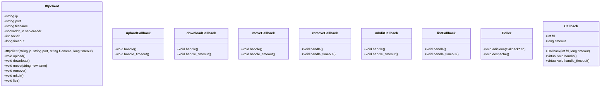

# Open TFTP

Open TFTP é uma implementação com novas funções do protocolo Trivial File Transfer Protocol (TFTP), conforme definido na [RFC 1350](https://datatracker.ietf.org/doc/html/rfc1350). O projeto foi ampliado para suportar não apenas operações básicas de upload e download, mas também funcionalidades de gerenciamento remoto de arquivos e diretórios, tais como renomeação, remoção, criação e listagem.

---

## Visão Geral

O TFTP é um protocolo leve que opera sobre UDP, projetado para transferência simples de arquivos. Este projeto implementa as seguintes operações:

- **Upload de arquivos (WRQ):** Envio de arquivos do cliente para o servidor.
- **Download de arquivos (RRQ):** Transferência de arquivos do servidor para o cliente.
- **Renomeação de arquivos (MOVE):** Permite renomear ou mover arquivos no servidor.
- **Remoção de arquivos (REMOVE):** Permite excluir arquivos do servidor.
- **Criação de diretórios (MKDIR):** Permite criar novos diretórios no servidor.
- **Listagem de diretórios (LIST):** Permite listar o conteúdo (arquivos e subdiretórios) de um diretório no servidor.
- **Tratamento de mensagens e erros:** Utiliza Google Protocol Buffers para a serialização/desserialização das mensagens, com callbacks e um poller para gerenciar timeouts e erros.

---

## Estrutura do Projeto

### Diretórios Principais

- **src/**: Contém os arquivos-fonte do projeto, incluindo a implementação do cliente TFTP e as classes de callbacks.
- **libs/**: Inclui bibliotecas auxiliares, como o Poller para controle assíncrono.
- **proto/**: Arquivos de definição de mensagens para o Google Protocol Buffers.

### Diagrama de Classes


```mermaid
classDiagram
    class tftpclient {
        +string ip
        +string port
        +string filename
        +sockaddr_in serverAddr
        +int sockfd
        +long timeout
        +tftpclient(string ip, string port, string filename, long timeout)
        +void upload()
        +void download()
        +void move(string newname)
        +void remove()
        +void mkdir()
        +void list()
    }

    class uploadCallback {
        +void handle()
        +void handle_timeout()
    }

    class downloadCallback {
        +void handle()
        +void handle_timeout()
    }

    class moveCallback {
        +void handle()
        +void handle_timeout()
    }

    class removeCallback {
        +void handle()
        +void handle_timeout()
    }

    class mkdirCallback {
        +void handle()
        +void handle_timeout()
    }

    class listCallback {
        +void handle()
        +void handle_timeout()
    }

    class Poller {
        +void adiciona(Callback* cb)
        +void despache()
    }

    class Callback {
        +int fd
        +long timeout
        +Callback(int fd, long timeout)
        +virtual void handle()
        +virtual void handle_timeout()
    }
```

---

## Funcionalidades

O projeto agora suporta as seguintes operações TFTP:

1. **Upload (WRQ):**  
   - Cria uma mensagem de Write Request com o nome do arquivo e o modo "octet".
   - Envia a mensagem ao servidor e utiliza um callback para gerenciar o envio dos blocos de dados.

2. **Download (RRQ):**  
   - Cria uma mensagem de Read Request com o nome do arquivo e o modo "octet".
   - Envia a mensagem ao servidor e utiliza um callback para gerenciar a recepção e gravação dos blocos.

3. **Renomeação (MOVE):**  
   - Envia uma mensagem MOVE contendo o nome original e o novo nome para o arquivo.
   - A operação é gerenciada por um callback que aguarda a confirmação do servidor.

4. **Remoção (REMOVE):**  
   - Envia uma mensagem MOVE (utilizada para remoção) com o nome do arquivo a ser excluído.
   - Utiliza um callback para tratar a remoção e possíveis erros.

5. **Criação de Diretório (MKDIR):**  
   - Envia uma mensagem MKDIR com o caminho do diretório a ser criado no servidor.
   - Um callback específico aguarda a confirmação do servidor.

6. **Listagem (LIST):**  
   - Envia uma mensagem LIST com o caminho do diretório.
   - Um callback processa a resposta e exibe os itens contidos no diretório.

## Interface de Linha de Comando (CLI)

O projeto implementa uma interface de linha de comando para facilitar a interação do usuário. Ao iniciar o programa, o usuário deve fornecer o IP e a porta do servidor TFTP. Em seguida, um prompt é exibido onde comandos podem ser inseridos. Os comandos disponíveis são:

- **get \<arquivo\>**  
  Baixa o arquivo especificado do servidor.
  
- **put \<arquivo\>**  
  Envia o arquivo especificado para o servidor.
  
- **dir \<diretório\>**  
  Lista o conteúdo do diretório especificado no servidor.
  
- **move \<origem\> \<destino\>**  
  Renomeia ou move o arquivo do nome de origem para o novo nome.
  
- **mkdir \<diretório\>**  
  Cria um novo diretório no servidor.
  
- **remove \<arquivo/diretório\>**  
  Remove o arquivo ou diretório especificado do servidor.
  
- **exit**  
  Encerra o programa.

### Exemplo de Uso da CLI

Ao executar o programa, o uso é o seguinte:

```bash
./tftpclient <IP> <PORTA>
```

Após a execução, o prompt será exibido:

```
tftp >
```

**Exemplos:**

- Para baixar um arquivo:
  ```
  tftp > get exemplo.txt
  ```
  
- Para enviar um arquivo:
  ```
  tftp > put exemplo.txt
  ```
  
- Para listar um diretório:
  ```
  tftp > dir diretorio_exemplo
  ```
  
- Para renomear um arquivo ou alterar de diretório:
  ```
  tftp > move exemplo.txt novo_nome.txt
  ```
  
- Para criar um diretório:
  ```
  tftp > mkdir novo_diretorio
  ```
  
- Para remover um arquivo ou diretório ( MOVE sem local ou novo nome ):
  ```
  tftp > move exemplo.txt
  ```
  
- Para sair:
  ```
  tftp > exit
  ```

Internamente, o programa converte o comando digitado para um enum correspondente e executa a operação apropriada, criando um objeto `tftpclient` com os parâmetros fornecidos e chamando o método correspondente.

---

## Como Compilar e Executar

### Compilação

Utilize o Makefile incluso para compilar o projeto:

```bash
make
```

### Execução

Para iniciar o cliente TFTP via CLI, utilize o seguinte comando:

```bash
./tftpclient <IP> <PORTA>
```

Exemplo:

```bash
./tftpclient 192.168.0.100 69
```

Após a execução, o prompt `tftp >` será exibido para que você insira os comandos conforme os exemplos acima.


